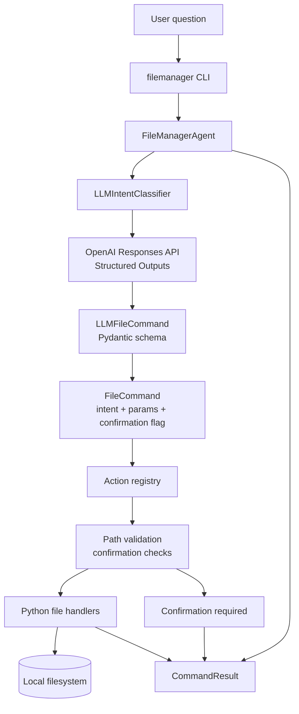

# Filemanager Intent Classifier

A small Python `uv` project with a `filemanager` agent. The agent reads a user's natural-language question, uses OpenAI Structured Outputs to classify the intent, and runs the matching safe Python file-management action.

## Run

```bash
uv run filemanager "create a new folder named goal"
```

Expected result:

```text
Created directory: goal
```

The LLM classifier requires:

```bash
export OPENAI_API_KEY="..."
```

Optional model override:

```bash
export FILEMANAGER_MODEL="gpt-5.4-nano"
```

## Supported intents

- Create a folder or directory, for example `create a new folder named goal`
- Create a file, for example `create a file named notes.txt`
- Rename a file or directory, for example `rename file old.txt to new.txt`
- Copy or move a file or directory
- Delete a file or directory, with confirmation
- Read or write a file
- List the current directory, for example `list files`

The agent only writes inside the working directory where it is run. Absolute paths and paths that escape the current directory are rejected.

## CLI options

```bash
uv run filemanager --root /some/path "create a file named notes.txt"
uv run filemanager --yes "delete the folder named old-build"
```

Use `--yes` for risky operations such as delete and overwrite.

## Architecture



The LLM is used only for classification. It returns a structured command that must match the `LLMFileCommand` schema:

- `intent`: one of the allowed file operation names
- `target`: path for single-target actions
- `source` and `destination`: paths for rename, copy, and move
- `content`: text for write operations
- `requires_confirmation`: true for risky actions
- `clarification_question`: question to show when required details are missing

The local agent owns execution. `FileManagerAgent.execute()` looks up the classified intent in the action registry, validates paths stay inside `--root` or the current working directory, blocks unsafe writes, and then calls Python filesystem APIs. The model never receives permission to run shell commands.

Risky operations are intentionally gated:

- Deletes always require `--yes`
- Overwrites require `--yes`
- Directory copy and move operations require `--yes`
- Any command classified with `requires_confirmation=true` requires `--yes`

## Making it generic

The implementation separates the agent into two parts:

- `LLMIntentClassifier.classify(question)` turns a natural-language question into a structured command, such as `rename_path` with `source` and `destination` parameters.
- `execute(command)` looks up the command in an action registry and calls the matching handler.

The LLM never executes shell commands. It only returns one of the allowed intents and parameters. Python validates paths and performs the filesystem operation.

## Tests

```bash
uv run pytest
```
